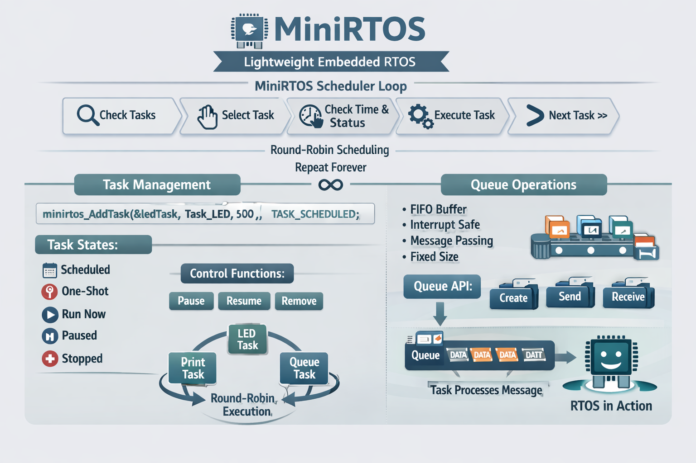

# MiniRTOS – Time-Based Round Robin RTOS for Bare-Metal Systems

MiniRTOS is a lightweight, cooperative, time-based round-robin RTOS written in C for bare-metal microcontroller systems.  
It is designed to be simple, readable, and educational, making it ideal for learning RTOS fundamentals and building small embedded applications.

---

## ✨ Features

- Time-based round-robin task scheduling
- Cooperative multitasking (no preemption)
- Periodic, one-shot, and immediate task execution
- Runtime task control (add, remove, pause, resume, modify)
- Circular linked-list based scheduler
- Lightweight interrupt-safe queue implementation
- No dynamic memory allocation in user code
- Low RAM and CPU usage
- CMSIS-compatible critical section handling
- Suitable for small microcontrollers

---

## 🏗 Architecture Overview

MiniRTOS uses a cooperative scheduling model where tasks are executed sequentially in a round-robin manner.

- A global system tick counter (`glbSysTicks`) is used for time management
- Each task contains:
  - Function pointer (the task body)
  - Execution interval (milliseconds)
  - Next scheduled execution time
  - Current task state
- Tasks are stored in a **circular linked list**
- The scheduler scans tasks and executes eligible ones



No context switching or stack management is involved — tasks run to completion before the next one is scheduled.

---

## 📌 Task Structure Explained

Each task is represented by a `Task_Descriptor_t`:

```c
typedef struct _Task_Descriptor_t {
    gptr_Task_Function taskPointer;   // Function pointer to task body
    uint32_t taskInterval;            // Interval between executions (ms)
    uint32_t plannedTask;             // Next scheduled execution time
    Task_Status_e taskStatus;         // Current state of the task
    struct _Task_Descriptor_t *gptrTaskNext; // Next task in circular list
} Task_Descriptor_t;
```
- Task Parts
    - taskPointer → The function that will run (e.g., LED toggle).
    - taskInterval → How often the task runs.
    - plannedTask → When the task will next execute (based on glbSysTicks).
    - taskStatus → Defines if the task is paused, scheduled, one-shot, etc.
    - gptrTaskNext → Links tasks together in a circular list.

## 📌 Task States

| State | Meaning |
| --- | --- |
| ``TASK_SCHEDULED`` | Runs periodically at the defined interval |
| ``TASK_ONE_SHOT`` | Runs once after the interval, then pauses |
| ``TASK_RUN_NOW`` | Executes immediately once added |
| ``TASK_ONE_SHOT_NOW`` | Executes immediately, only once |
| ``TASK_PAUSE`` | Task execution paused |
| ``TASK_RUNNING`` | Task is currently executing |
| ``TASK_NOT_FOUND`` | Error state if descriptor invalid |

## 📌 Queue Operations
MiniRTOS includes a simple interrupt-safe queue mechanism:

```c
typedef struct {
    void *buffer;       // User-allocated memory
    uint16_t elementSize;
    uint16_t maxElements;
    uint16_t head;      // Read index
    uint16_t tail;      // Write index
    uint16_t count;     // Number of elements
} Queue_Descriptor_t;
```
- Queue APIs
    - Create Queue → minirtos_Queue_Create()
    - Send (Enqueue) → minirtos_Queue_Send()
    - Receive (Dequeue) → minirtos_Queue_Receive()
    - Count Elements → minirtos_Queue_Count()
    - Flush Queue → minirtos_Queue_Flush()
    - All operations are interrupt-safe using critical sections.

## 📌 Scheduler Working Step-by-Step
The scheduler (minirtos_Scheduler) runs in an infinite loop:
- Check if tasks exist  
  - If no tasks are added, scheduler does nothing.
- Pick current task  
  - Scheduler points to the current task in the circular list.
- Check task status
  - If TASK_PAUSE, skip.
  - If active, check if its plannedTask time has elapsed.
- Execute task
  - If one-shot → run once, then pause.
  - If periodic → run, then reschedule plannedTask.
- Move to next task  
  - Scheduler pointer advances to the next task in the circular list.
- Repeat forever  
   - This creates a cooperative round-robin execution model.

## 🚀 Getting Started
1. **Include MiniRTOS**
    ```c
        #include "minirtos.h"
    ```
2. **Define Tasks**
    ```c
        Task_Descriptor_t ledTask;
        Task_Descriptor_t queueconsumer;

        // Queue setup
        Queue_Descriptor_t myQueue;
        uint8_t queueBuffer[10 * sizeof(uint32_t)];

        void Task_LED(void)
        {
            HAL_GPIO_TogglePin(GPIOA, GPIO_PIN_5);
        }

        // ISR sends tick value into queue
        void EXTI15_10_IRQHandler(void)
        {
            if (__HAL_GPIO_EXTI_GET_IT(GPIO_PIN_13) != RESET)
            {
                __HAL_GPIO_EXTI_CLEAR_IT(GPIO_PIN_13);
                uint32_t value = glbSysTicks;
                minirtos_Queue_Send(&myQueue, &value);
            }
        }

        // Task consumes queue data
        void Task_QueueConsumer(void)
        {
            uint32_t receivedValue;
            if (minirtos_Queue_Receive(&myQueue, &receivedValue))
            {
                char msg[50];
                sprintf(msg, "Queue received tick: %lu\r\n", (unsigned long)receivedValue);
                HAL_UART_Transmit(&huart2, (uint8_t*)msg, strlen(msg), HAL_MAX_DELAY);
            }
        }
    ```
3. **Create Tasks**
    ```c
        minirtos_AddTask(
            &ledTask,
            Task_LED,
            500,
            TASK_SCHEDULED
        );
        minirtos_AddTask(
            &queueconsumer,
            Task_QueueConsumer,
            1000,
            TASK_SCHEDULED
        );
    ```

4. **Run Scheduler**
   
    ```c
        while(1)
        {
            minirtos_Scheduler();
        }
    ```

## 📌 Limitations
- No task preemption
- No priority-based scheduling
- No software timers
- No mutexes or semaphores
- Requires external system tick source

## 📜 License
Released under the MIT License.

## 👨‍💻 Author
Sourabh Potdar
Embedded Systems Developer

